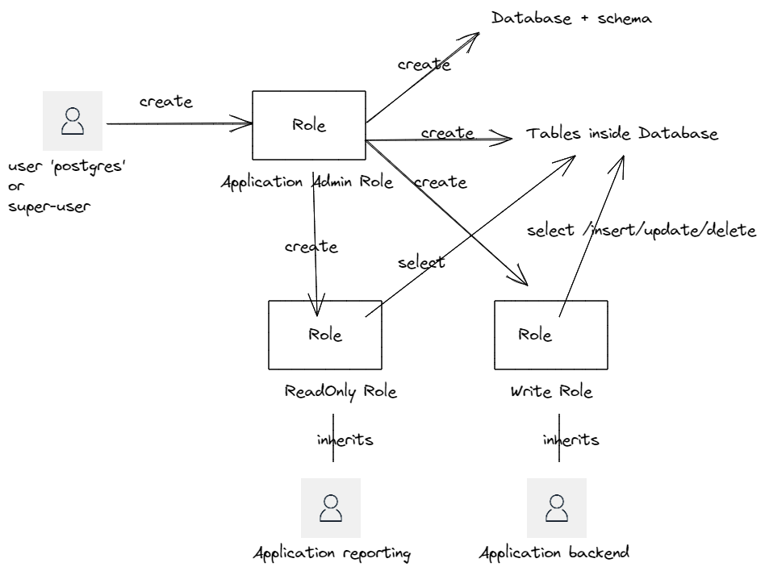

# terraform-postgresql-database-admin

Terraform is a great tool to automate "everything" in modern IT. Based on my own experience, i will propose you an abstraction for the management "inside a database" : the management of users and their permissions in a postgresql database. 

This module provides a way to manage securly and properly, the objects, inside a postgresql database. Based on best practices, describe in this blog : 

https://aws.amazon.com/blogs/database/managing-postgresql-users-and-roles/

Moreover, for a database deployed through the AWS Managed Service "RDS", this module also provides a way to deploy an audit system allowing to trace all the requests made, by whom, at what time and from which IP address.

The module is divided into 2 sub-modules and several examples that illustrates different aspects of this problematic.

* The creation of the database with the roles and the permissions associated with (named grant inside postgresql).
* The creation of the user. For security perspective, user inherits permissions from role. A user should have an expiration date for his password.

The diagram below illustrate what we neeed to do : 

|Actor|Remarks|
|------|------|
|the user `postgres` or the super-user|This user should not be used in daily tasks. Instead, create an admin role on which you delegate high level permissions|
|Application admin Role|This role will be the owner of the database and all objects inside the database. It can create database,tables inside database and roles. |
|ReadOnly Role|the role with grants that allowing select on tables|
|Write Role|the role with grants that allowing select/insert/update/delete on tables|
|the user `application reporting`| This user is used inside the reporting application. |
|the user `application backend`| This user is used inside the backend application. |

Note : Roles are independent from the database and schema. But we advice to create the 3 roles (admin,readonly,write) for each database and do not shared roles accross databases. That why we prefixe the name of the role by `app`, a trigram that can easily differentiate role in real usecases. 
Note : We create 3 roles (admin,write,readonly) but you can be more granular. By example, splitting the role write into several write roles, allowing the permissions insert/update/delete only on specific tables. the security pattern `Least privilege` can be applied at this level.

## Modules Description

### create-database

This sub-module is in charge to create : 

* `postgresql database` : In some case, you need to create the database first.

* `postgresql role` : following best practices, we will create `role` in a first step. Those roles will handle grants (=permissions).

* `postgresql grant` : the list of grants that will be associated to the role.

Check the `simple-database` usecase to have a complete example.

### create-users & Password Management

This sub-module is in charge to create : 

* `postgresql role` : a user is a role that inherits permissions from roles and have the option 'login' = true. A user can have an expiration date. It's a good practice to expire password for human users.

* Regarding `password management` inside a terraform module, it could be complex to manage properly passwords inside a generic module. You can refer to this excellent post to manage securly your passwords : https://blog.gruntwork.io/a-comprehensive-guide-to-managing-secrets-in-your-terraform-code-1d586955ace1. A system of `postprocessing playbook` is available to set password securely.

check the `create-users-on-existent-database` or `all-in-one` usecases to have complete examples.

## Usecases

|Example|UseCase|
|-------|--------|
|[simple-database](./example/simple-database/HOWTO.md)|Demonstration How to create Database, Roles, and Grants objects|
|[create-users-on-existent-database](./example/create-users-on-existent-database/HOWTO.md)|From an existent database, you can create several users. This usecase use a trivial postprocessing playbook for example. **DO NOT USE THIS PLAYBOOK IN PRODUCTION, IT's NOT SAFE.**|
|[all-in-one](./example/all-in-one/HOWTO.md)|Demonstration How to create Database, Roles, Users in one phase. This usecase use a postprocessing playbook that generate passwords, set password for each users, and store the password in the parameterStore into an AWS Account.|
|[full-rds-example](./example/full-rds-example/HOWTO.md)|Demonstration for other features covered by the module : Demonstrate an another postprocessing playbook that generate passwords into AWS SecretsManager, deploy the `pgaudit` extension for real-time monitoring, and deploy lambda to stream the audit logs.|

### Prerequirements

Those modules uses the excellent [postgresql provider](https://registry.terraform.io/providers/cyrilgdn/postgresql/latest/docs). for each usecase, you need to have : 

* the network connectivity to your database (by example, if you launch your terraform scripts from a gitlab-ci runner, your runners must reach the database)
* the credentials of a user with the required permissions to connect on a postgresql instance, to create database etc ... Often, we use postgres user for the postgresql provider, and a custom admin user for creating database and other objects. For the password, to avoid passing in clear text the password used by the postgresql provider, use the native postgresql mechanism by setting an environment variable **PGPASSWORD**.

### Tests environment

You can find a docker-compose file to start locally a postgresql (version 13.4) database and set the password for postgres user. Use the command **docker-compose -f docker-compose.yml up -d**.  

## Inputs & outputs

you could find all Inputs & outputs of each submodule here :

### create-database

[docs](./create-database/README.md)

### create-users

[docs](./create-users/README.md)

### lambda-stream-audit

[docs](./lambda-stream-audit/README.md)

### :warning: Important note:

We highly recommand you using **explicitly a version tag of this module** instead of branch reference since the latter is changing frequently. (use **ref=v1.0.0**,  don't use **ref=master**) 